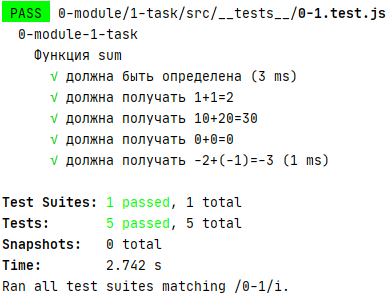
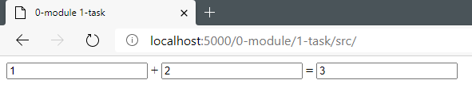

# A+B

Это первая задача курса, которая поможет разобраться с тем, как устроен задачник, а также с тем, как оформлять решение и отправлять его на проверку.

В модуле `sum.js` необходимо реализовать функцию `sum`, которая принимает два числа и возвращает их сумму.

###### Результат

---

**- Для решения отредактируйте файл `sum.js`**

**- Доступно автоматическое тестирование**
